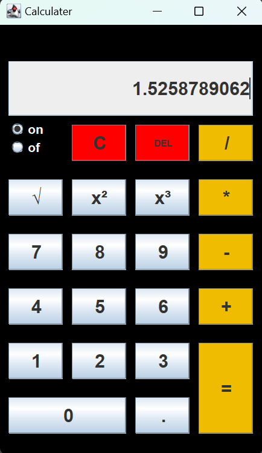

# **Java Calculator**

This is a simple calculator application developed in Java using the Swing library for the graphical user interface (GUI). The calculator supports basic arithmetic operations along with additional features like squaring, cubing, and square root.

## *Features*

- **Basic Operations**: Addition, Subtraction, Multiplication, Division
- **Advanced Operations**: Squaring, Cubing, Square Root
- **Clear and Delete**: Options to clear the current input or delete the last character
- **On/Off Toggle**: Toggle to enable or disable the calculator

## Installation

1. **Clone the Repository:**
   ```bash
   git clone https://github.com/yourusername/java_calculater.git
   ```
   
2. **Compile the Java File:**
   ```bash
   javac Main.java
   ```
   
3. **Run the Application:**
   ```bash
   java Main
   ```

## Usage

Once the application is running, you can use the GUI to perform calculations. The buttons correspond to numbers, operators, and functions. The display at the top shows the current input and result.

### Controls

- **Numeric Buttons**: Enter numbers (0-9)
- **Operator Buttons**: Perform operations (+, -, *, /)
- **Advanced Functions**: `x²`, `x³`, `√` for squaring, cubing, and square root respectively
- **DEL**: Delete the last entered character
- **C**: Clear the entire input
- **On/Off**: Toggle the calculator's power

## Screenshots


## License

This project is licensed under the MIT License - see the LICENSE file for details.

## Acknowledgments

- Inspired by basic calculators.

---
